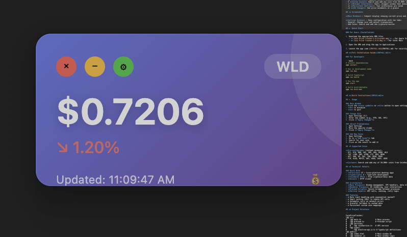

# Coin Price Tracker



🚀 A lightweight, always-on-top cryptocurrency price tracker for macOS.


## ✨ Features

- 🔝 **Always on Top**: Window stays above all other applications
- 🎨 **Adjustable Transparency**: Control opacity from 30-100%
- 💰 **Real-time Prices**: Live cryptocurrency prices from CoinGecko
- 🔄 **Auto-refresh**: Updates every 2 minutes automatically
- ➕ **Custom Coins**: Search and add any coin from 10,000+ available
- 🎯 **Minimal Interface**: Small, elegant window that doesn't get in the way
- 💾 **Persistent Settings**: Your preferences are saved
- 📊 **24h Change**: See price movements at a glance

## 📸 Screenshots

**Main Window** - Compact display showing current price and 24h change

**Settings Window** - Easy configuration with two tabs:
- General: Change coin and adjust transparency
- Add Coins: Search and add new cryptocurrencies

## 🚀 Quick Start

### For Users (Installation)

#### macOS
1. Download the appropriate DMG file:
   - **[Download for Apple Silicon (M1/M2/M3/M4)](https://github.com/nhathuy7996/coin-price-tracker/releases/tag/macOS-silicon)** - `Coin Price Tracker-1.0.0-arm64.dmg`
   - **[Download for Intel Macs](https://github.com/nhathuy7996/coin-price-tracker/releases/tag/macos-intel)** - `Coin Price Tracker-1.0.0.dmg`

2. Open the DMG and drag the app to Applications

3. Launch the app (see [INSTALL.md](INSTALL.md) for security notes)

#### Windows
1. **[Download for Windows](https://github.com/nhathuy7996/coin-price-tracker/releases/tag/windows)**
   - `Coin Price Tracker Setup 1.0.0.exe` - Installer (recommended)
   - `Coin Price Tracker 1.0.0.exe` - Portable version (no installation required)

2. Run the installer or portable executable

3. Launch the app

📖 **[Full Installation Guide](INSTALL.md)**

### For Developers

```bash
# Install dependencies
npm install

# Run in development mode
npm run dev

# Build TypeScript
npm run build

# Run the app
npm start

# Build distributable
npm run dist:mac
```

📖 **[Build Instructions](BUILD.md)**

## 🎮 Usage

### Main Window
- Click the **coin symbol** or **⚙️** button to open settings
- **−** to minimize
- **×** to quit

### Change Coin
1. Open Settings (⚙️)
2. Enter new symbol (e.g., ETH, SOL, BTC)
3. Click **"Apply Changes"**

### Adjust Transparency
1. Open Settings
2. Move the opacity slider
3. Click **"Apply Changes"**

### Add New Coins
1. Open Settings
2. Go to **"Add Coins"** tab
3. Search for your coin
4. Click on the result to add it

## 🪙 Supported Coins

**Pre-configured** (instant access):
- BTC, ETH, BNB, SOL, XRP, ADA, DOGE, WLD
- TRX, LINK, UNI, ATOM, LTC, BCH, NEAR
- APT, ARB, OP, SUI, TON, SHIB, PEPE
- FTM, ALGO, MATIC, DOT, AVAX, USDT, USDC

**Custom**: Search and add any of 10,000+ coins from CoinGecko

## 🔧 Technical Details

### Built With
- **Electron** 27 - Cross-platform desktop apps
- **TypeScript** 5 - Type-safe development
- **CoinGecko API** - Free cryptocurrency data
- **Axios** - HTTP client

### Architecture
- **Main Process**: Window management, IPC handlers, data storage
- **Renderer Process**: UI rendering, user interactions
- **Preload Script**: Secure bridge between processes
- **Service Layer**: API calls, caching, retry logic

### Features
- ✅ Rate limit handling with exponential backoff
- ✅ Smart caching (60s) to reduce API calls
- ✅ Automatic retry on network errors
- ✅ Graceful fallback to cached data
- ✅ Persistent custom coin mappings

## 📁 Project Structure

```
CoinPriceTracker/
├── src/
│   ├── main.ts              # Main process
│   ├── preload.ts           # Preload script
│   ├── services/
│   │   └── coinService.ts   # API service
│   └── types/
│       └── electron-api.d.ts # TypeScript definitions
├── public/
│   ├── index.html           # Main window UI
│   ├── renderer.js          # Main window logic
│   ├── settings.html        # Settings window UI
│   └── settings.js          # Settings window logic
├── dist/                    # Compiled JavaScript
├── release/                 # Built applications
├── package.json
├── tsconfig.json
├── README.md
├── BUILD.md                 # Build instructions
└── INSTALL.md              # Installation guide
```

## ⚙️ Configuration

Settings are stored in:
```
~/Library/Application Support/coin-price-tracker/
```

- `custom-coin-mappings.json` - Your added coins

## 🐛 Known Issues

- **Rate Limiting**: CoinGecko free tier has limits (~30 requests/hour)
  - Solution: App caches prices and uses 2-minute refresh interval
  
- **macOS Security Warning**: Unsigned app triggers Gatekeeper
  - Solution: Right-click → Open (see INSTALL.md)

## 🔮 Future Enhancements

- [ ] Multiple coin widgets
- [ ] Price alerts and notifications
- [ ] Historical price charts
- [ ] Portfolio tracking
- [ ] Dark/Light theme toggle
- [ ] Customizable refresh intervals
- [ ] Support for multiple fiat currencies

## 📝 License

MIT License - feel free to use and modify!

## 🙏 Credits

- **CoinGecko** for free cryptocurrency API
- **Electron** team for the framework
- All the amazing open-source contributors

## 📞 Support

Having issues? Check:
1. [Installation Guide](INSTALL.md)
2. [Build Guide](BUILD.md)
3. GitHub Issues (if available)

---

Made with ❤️ for crypto enthusiasts

**Star ⭐ this repo if you find it useful!**
